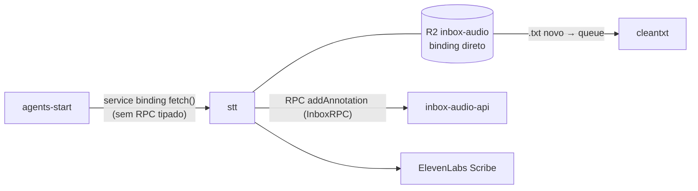
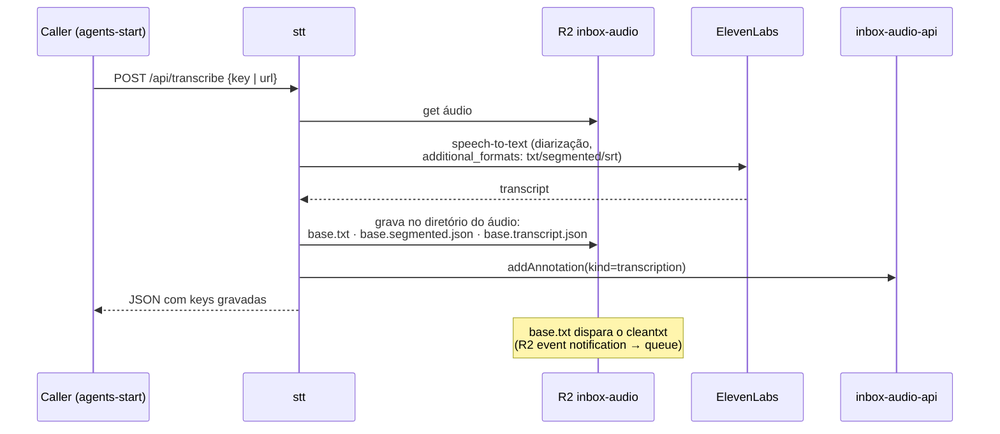

# mtext · stt

> ⚠️ **DEPLOY CONGELADO.** O worker `stt` em produção está à frente deste
> source e do GitHub — alterações foram aplicadas diretamente em produção e
> não existem neste repositório. `wrangler deploy` a partir daqui faria
> downgrade silencioso. Este repositório é referência histórica e
> documentação do comportamento em produção. Alterações de transcrição
> devem ser feitas em outro worker.

Worker de transcrição de áudio: converte os áudios do bucket R2
`inbox-audio` em texto via ElevenLabs Scribe (com diarização) e grava os
resultados ao lado do arquivo de origem.

## Posição no sistema



## Fluxo (worker em produção)



Notas:

- Layout do bucket é contrato (`Paciente/Cx - DDMMAA/arquivo`); os outputs
  ficam sempre no mesmo diretório do áudio de origem.
- `*.transcript.json` contém o retorno bruto do ElevenLabs, incluindo
  `additional_formats`. Serve de fonte de recuperação (já usado para
  restaurar arquivos corrompidos por pipeline downstream). Não remover.
- O frontend React presente neste template não é usado em produção.

## Operação

```bash
npx wrangler tail stt    # observação; único comando seguro neste repo
# npx wrangler deploy    # NÃO EXECUTAR — ver aviso no topo
```
