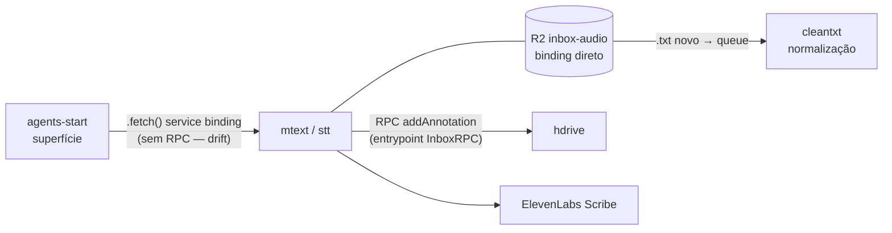
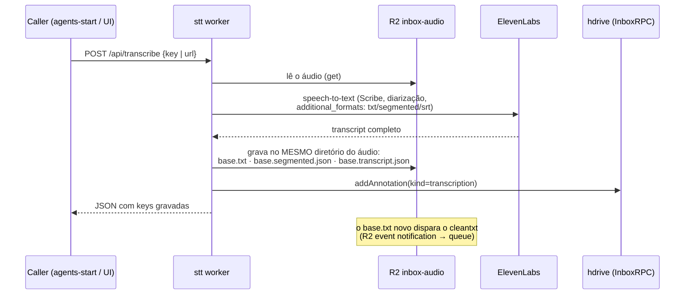

# mtext · stt

> ⚠️ **DEPLOY CONGELADO — NUNCA rode `wrangler deploy` neste repo.**
> O worker `stt` em produção está **à frente** deste source (e do GitHub):
> mudanças foram feitas direto em produção e não existem aqui. Um redeploy
> a partir deste código faria **downgrade silencioso** da transcrição
> clínica. Este repositório serve apenas como referência histórica e
> documentação. Correções vão em outros órgãos (hdrive/cleantxt) ou num
> worker novo — nunca aqui.

Órgão de **transcrição** do CloudHealthSphere (CHS/healthOS · VOITHER):
converte os áudios clínicos do bucket `inbox-audio` em texto via
**ElevenLabs Scribe** com diarização. Sistema completo: README do
[`agents-start`](https://github.com/myselfgus/agents-start) (hub).

## Posição no organismo



## Fluxo de transcrição (worker em produção)



- **Layout do bucket é contrato**: `Paciente/Cx - DDMMAA/arquivo` — os
  outputs vão sempre ao lado do áudio de origem. Todo o resto do sistema
  (hdrive, cleantxt, explorer do agents-start) depende disso.
- `transcript.json` guarda o retorno bruto do ElevenLabs
  (`additional_formats` incluído) — foi ele que permitiu restaurar arquivos
  corrompidos num incidente do pipeline; **nunca apagar**.
- O frontend React deste template não é usado em produção; a interface real
  é o agents-start/hdrive.

## Operação

```bash
npx wrangler tail stt     # observar — o ÚNICO comando seguro
# npx wrangler deploy     # ❌ PROIBIDO (ver aviso no topo)
```

Evoluções de transcrição devem nascer fora deste worker (novo órgão ou
extensão do hdrive), consumindo o mesmo bucket e o mesmo InboxRPC.
